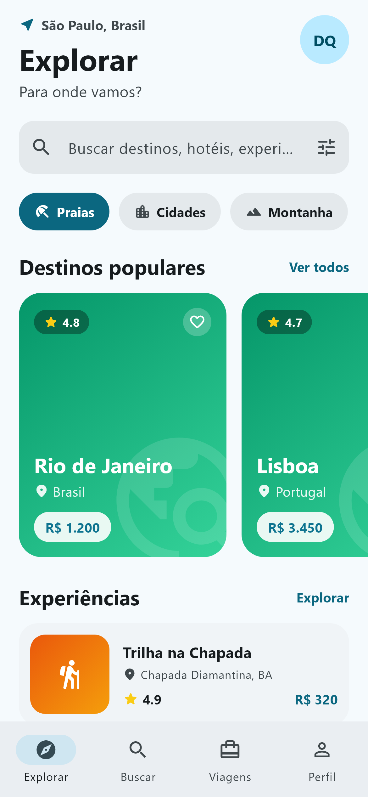
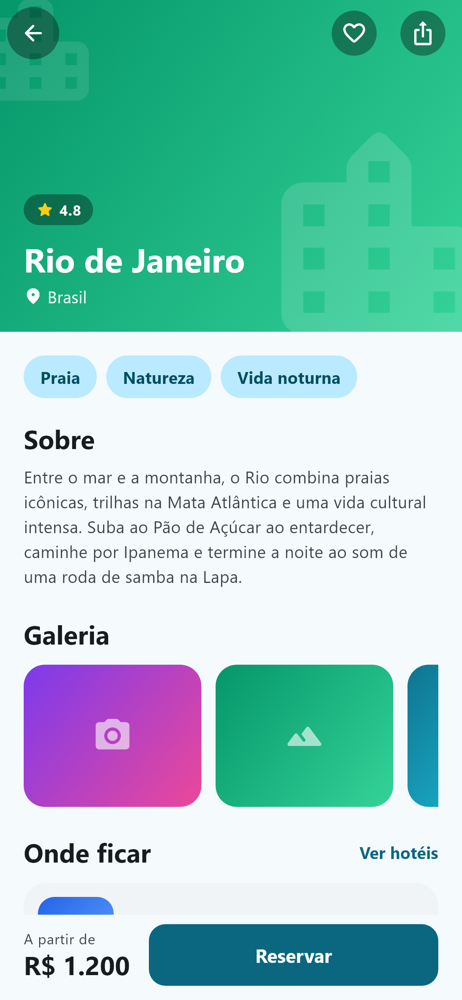
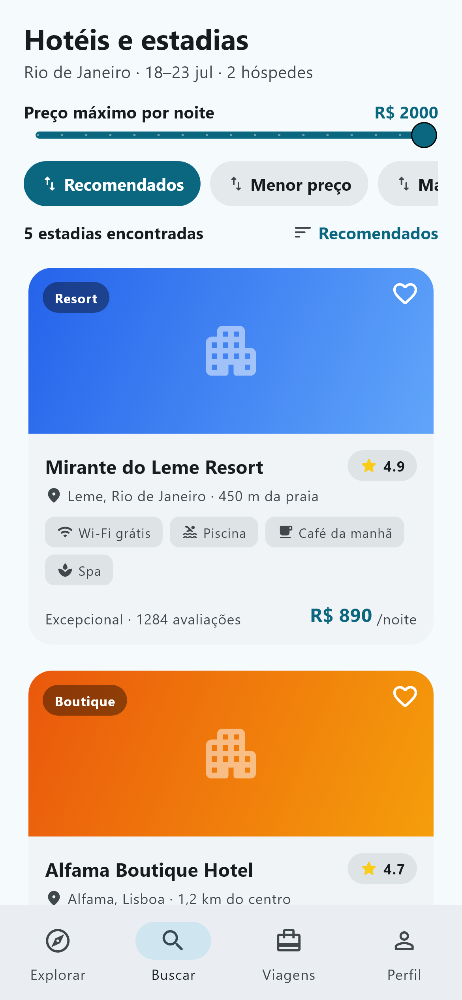
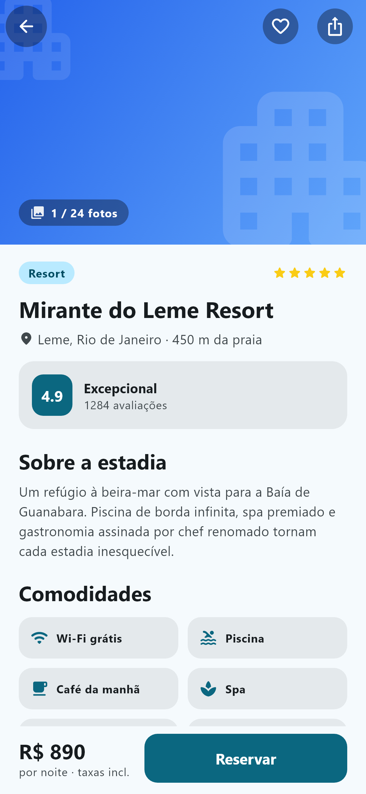
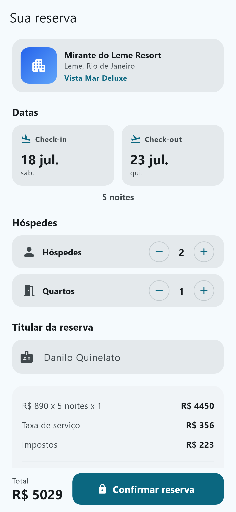
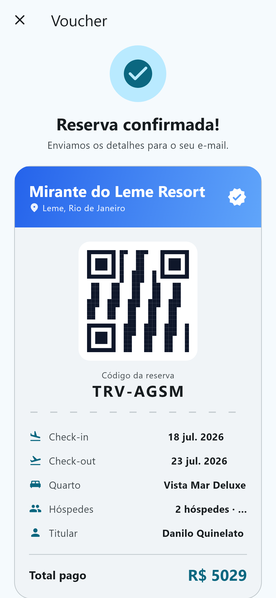

# Flutter Travel

[Read in English](./README.md)

[](./LICENSE) 

Flutter Travel é um template gratuito de viagens e reservas construído com Flutter 3.44 e Material 3. São 8 telas com tema claro e escuro cobrindo o fluxo da viagem, da descoberta ao voucher: explorar com destinos e experiências, página do destino, lista de hotéis com filtros de preço e estrelas, página do hotel com comodidades e mapa desenhado em CustomPaint, formulário de reserva com datas e hóspedes, voucher com QR Code, lista de viagens e perfil com status de fidelidade. A navegação combina um shell de 4 abas com rotas empilhadas do go_router. Todos os dados são mocks locais, então o app roda sem backend, e os serviços http indicam onde uma API real entraria. Faz parte da faixa gratuita do catálogo [template.dev.br](https://template.dev.br).

## Telas

8 telas:

- Explorar (`explore_screen.dart`): destinos populares, experiências e preços.
- Destino (`destination_detail_screen.dart`): página do destino com destaques.
- Hotéis (`hotels_screen.dart`): lista de hotéis com filtros de preço e estrelas.
- Hotel (`hotel_detail_screen.dart`): comodidades, avaliações e mapa de localização desenhado em CustomPaint.
- Reserva (`booking_screen.dart`): formulário de reserva com datas e quantidade de hóspedes.
- Voucher (`voucher_screen.dart`): confirmação da reserva com QR Code.
- Viagens (`trips_screen.dart`): viagens futuras e passadas.
- Perfil (`profile_screen.dart`): dados do usuário e status do programa de fidelidade.

### Capturas de tela

A pasta `screenshots/` tem 16 capturas. Uma amostra:








## Stack

- Flutter 3.44, canal stable (fixado via FVM no `.fvmrc`)
- Dart SDK `^3.12.2`
- Material 3 (`useMaterial3: true`, `ColorScheme.fromSeed`)
- go_router `^17.3.0`: navegação declarativa
- provider `^6.1.5+1`: gerenciamento de estado (view models MVVM)
- http `^1.6.0`: camada de serviços de API
- intl `^0.20.3`: formatação de datas e moeda (símbolos de data pt_BR carregados na inicialização)
- cupertino_icons `^1.0.8`
- flutter_lints `^6.0.0` (dev)

As versões exatas resolvidas estão no `pubspec.lock`. Plataformas incluídas no repositório: Android, iOS, web e Windows.

## Requisitos

- Flutter SDK, canal stable. O lockfile exige Flutter 3.38 ou mais novo; o template foi construído com a 3.44.
- Dart 3.12.2 ou mais novo (vem junto com o Flutter SDK).
- Ferramentas da plataforma alvo: Android Studio e Android SDK, Xcode para iOS, Chrome para web, ou Visual Studio com o workload de C++ para Windows.
- Opcional: [FVM](https://fvm.app). O repositório tem um `.fvmrc` fixando o canal stable, então `fvm use` seleciona um SDK compatível.

## Como rodar

```bash
flutter pub get
flutter run
```

Escolha o dispositivo com `flutter run -d chrome` (web), `flutter run -d windows`, ou um id listado em `flutter devices`.

Builds de release:

```bash
flutter build apk       # Android
flutter build ipa       # iOS (exige macOS e Xcode)
flutter build web       # Web
flutter build windows   # Windows
```

Com FVM, prefixe os comandos: `fvm flutter pub get`, `fvm flutter run`. Rode os testes de widget com `flutter test`.

## Estrutura do projeto

```
lib/
  main.dart              # ponto de entrada, carrega símbolos de data pt_BR (intl)
  app.dart               # MaterialApp.router, temas claro/escuro
  core/
    router.dart          # tabela de rotas do go_router
    theme.dart           # tema Material 3 (cor seed, temas de componentes)
  data/
    models/              # modelos de API com fromJson/toJson
    repositories/        # destino, hotel, reserva, viagem, perfil (dados mock)
    services/            # stubs de serviço de API com http
  domain/
    models/              # Destination, Hotel, Review, Booking, Trip, UserProfile
  ui/
    core/widgets/        # widgets compartilhados
    features/<feature>/  # views/ (telas) e view_models/ por funcionalidade
```

## Tema e personalização

O tema fica em `lib/core/theme.dart`. Os esquemas claro e escuro são gerados a partir de uma única cor seed:

```dart
static const Color seed = Color(0xFF0E7490); // ciano/teal
```

Troque `seed` para mudar a cara do app inteiro: `ColorScheme.fromSeed` deriva todas as cores de superfície e destaque para os dois brilhos. A família de fonte é Roboto, definida no mesmo arquivo, junto com temas de componentes para app bar, botões preenchidos e inputs (campos de texto preenchidos, cantos arredondados, elevação zero). O `app.dart` passa `AppTheme.light()` e `AppTheme.dark()` para o `MaterialApp.router`, então o app segue o tema do sistema.

As datas são formatadas com `intl` no locale pt_BR; o `main.dart` chama `initializeDateFormatting('pt_BR', null)` antes do `runApp`. Para trocar o locale, atualize essa chamada e os locales de `DateFormat` nas views.

## Gerenciamento de estado

MVVM com provider. Cada tela tem um view model `ChangeNotifier` em `lib/ui/features/<feature>/view_models/`, criado com `ChangeNotifierProvider` nas definições de rota em `lib/core/router.dart`. Os view models leem dos repositórios em `lib/data/repositories/`, que retornam dados mock através dos serviços em `lib/data/services/`.

## Apoie o projeto

Este template é gratuito e tem licença MIT. As doações mantêm os templates gratuitos atualizados a cada versão nova do Flutter: https://template.dev.br/doar?template=flutter-travel

## Mais templates

O catálogo completo, com templates grátis e premium, está em https://template.dev.br.

## Licença

[MIT](./LICENSE), © 2026 Danilo Quinelato.
